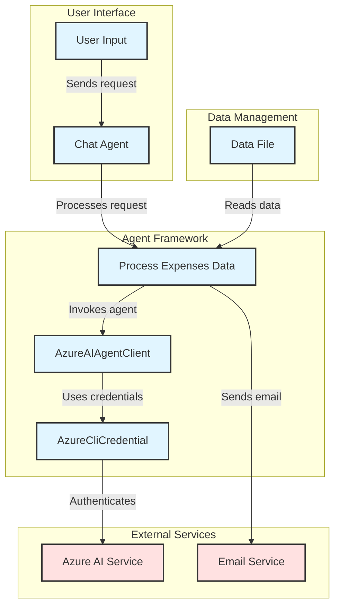

# Generated Architecture Diagram

## Mermaid Diagram

Based on the provided repository structure and the analysis of the `agent-framework.py` code, I've created a comprehensive Mermaid flow diagram that captures the architecture, data flow, and component interactions. The diagram is structured to highlight the main components, their interactions, and the external services involved.

Here's the Mermaid diagram:



### Diagram Explanation:

1. **User Interface**: 
   - The user provides input that is sent to the Chat Agent.

2. **Agent Framework**:
   - The Chat Agent processes the request and invokes the `Process Expenses Data` function.
   - This function interacts with the `AzureAIAgentClient` to handle the AI-related tasks.
   - The `AzureCliCredential` is used for authentication.

3. **External Services**:
   - The `AzureCliCredential` authenticates with the Azure AI Service.
   - The `Process Expenses Data` function also sends an email through the Email Service when required.

4. **Data Management**:
   - The data file (`data.txt`) is read by the `Process Expenses Data` function to provide context for the user's requests.

### Color Coding:
- **User Code**: Components that are part of the application logic are colored in light blue.
- **External Services**: Components that represent external services (like Azure AI and Email Service) are colored in light red.

This diagram provides a clear overview of the architecture and interactions within the system, following the professional style similar to Azure documentation.

---

## Repository Structure

```
├── .env
├── AzureAIAgentClient-Flow-Diagram.md
├── agent-framework.py
├── data.txt
└── generate-architecture-diagram.py
```
