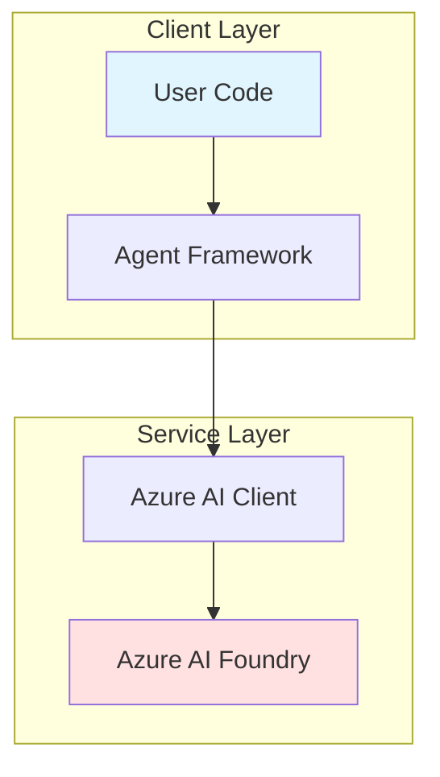
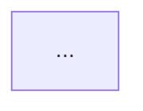

# Guide: Using LLM to Generate Architecture Diagrams from Source Code

This guide explains how to use Large Language Models (LLMs) to analyze a codebase and generate Mermaid architecture diagrams similar to professional Azure documentation.

## Table of Contents

1. [Overview](#overview)
2. [Multi-Pass Analysis Strategy](#multi-pass-analysis-strategy)
3. [Prompt Engineering Techniques](#prompt-engineering-techniques)
4. [Implementation Approaches](#implementation-approaches)
5. [Best Practices](#best-practices)
6. [Example Workflow](#example-workflow)

---

## Overview

The attached image shows a sophisticated architecture flow diagram with:
- **Component grouping** (subgraphs for client, framework, Azure services)
- **Directional data flow** (arrows showing communication paths)
- **External integrations** (Azure AI Foundry service)
- **Color-coded elements** (visual hierarchy)
- **Detailed annotations** (descriptive labels)

To generate similar diagrams programmatically, we need a structured approach.

---

## Multi-Pass Analysis Strategy

### Pass 1: Repository Structure Analysis

**Purpose**: Understand the high-level organization

```python
# Scan file structure
def analyze_structure(repo_path):
    structure = {
        'entry_points': [],      # main.py, index.js, app.py
        'modules': {},           # Package/module organization
        'configs': [],           # Configuration files
        'tests': [],             # Test directories
        'dependencies': []       # Package.json, requirements.txt
    }
    return structure
```

**LLM Prompt**:
```
Analyze this repository structure and identify:
1. Main entry points
2. Module organization patterns
3. Architectural layers (presentation, business, data)
4. Configuration management approach

Structure:
[paste file tree]
```

### Pass 2: Code Flow Analysis

**Purpose**: Trace execution paths and data flow

```python
# Extract import statements and function calls
def analyze_flow(files):
    flow_graph = {
        'imports': {},          # Module dependencies
        'function_calls': {},   # Call hierarchy
        'data_flow': {},        # Data transformations
        'external_apis': []     # External service calls
    }
    return flow_graph
```

**LLM Prompt**:
```
Analyze these code files and trace:
1. The primary execution flow from entry point
2. Key function call sequences
3. Data transformations and state changes
4. External API/service integrations

Focus on: [specific files]
```

### Pass 3: Architecture Pattern Recognition

**Purpose**: Identify design patterns and architectural styles

**LLM Prompt**:
```
Identify the architectural patterns in this codebase:
1. Overall architecture style (MVC, microservices, layered, etc.)
2. Design patterns used (factory, singleton, observer, etc.)
3. Communication patterns (synchronous, async, events)
4. Integration patterns (API calls, message queues, etc.)

Code samples:
[paste relevant code]
```

### Pass 4: Mermaid Diagram Generation

**Purpose**: Synthesize analysis into visual diagram

**LLM Prompt**:
```
Generate a Mermaid flowchart diagram that shows:

1. **Main components** as nodes
2. **Data/control flow** as directional arrows
3. **Component grouping** using subgraphs
4. **External services** clearly highlighted
5. **Color coding** by component type:
   - User/Application code: #e1f5ff (light blue)
   - Frameworks/Libraries: #fff4e1 (light yellow)
   - External Services: #ffe1e1 (light red)

Requirements:
- Use `graph TD` or `graph LR` format
- Include descriptive labels
- Show async/streaming flows where applicable
- Annotate key interactions

Context from previous analysis:
[paste structure + flow + patterns]
```

---

## Prompt Engineering Techniques

### Technique 1: Progressive Context Building

Build context incrementally rather than all at once:

```python
# Step 1: High-level overview
prompt_1 = "List the 5 main components of this system: [files]"

# Step 2: Detailed component analysis
prompt_2 = f"For component '{component}', describe its responsibilities and interfaces"

# Step 3: Integration analysis
prompt_3 = f"How do these components interact: {components}"

# Step 4: Diagram generation
prompt_4 = "Based on the above analysis, generate a Mermaid diagram"
```

### Technique 2: Example-Driven Prompting

Provide examples of desired output:

```
Generate a diagram similar to this example:



Your diagram should follow this style but reflect the actual architecture.
```

### Technique 3: Constraint-Based Prompting

Specify clear constraints:

```
Generate a Mermaid diagram with these constraints:

1. Maximum 15 nodes (focus on main components)
2. Maximum 3 levels of subgraphs
3. Use only these node shapes:
   - [ ] for code components
   - [( )] for external services
   - [{ }] for databases
4. Limit arrows to primary flows only
5. Include brief annotations on arrows
```

### Technique 4: Iterative Refinement

Use multiple rounds with feedback:

```python
# Round 1: Initial diagram
diagram_v1 = llm.generate(prompt_1)

# Round 2: Refine based on missing details
prompt_2 = f"""
The diagram is good but missing:
1. Error handling flow
2. Authentication flow
3. Streaming response handling

Previous diagram:
{diagram_v1}

Please update to include these flows.
"""
diagram_v2 = llm.generate(prompt_2)
```

---

## Implementation Approaches

### Approach 1: Single-Shot Generation

**Pros**: Fast, simple
**Cons**: May miss details, limited by context window

```python
async def generate_single_shot(repo_path):
    # Gather all context
    structure = scan_structure(repo_path)
    code_samples = extract_key_files(repo_path)
    
    # Build comprehensive prompt
    prompt = build_prompt(structure, code_samples)
    
    # Generate diagram
    diagram = await llm.complete(prompt)
    return diagram
```

### Approach 2: Multi-Stage Pipeline

**Pros**: More accurate, handles large codebases
**Cons**: Slower, more complex

```python
async def generate_multi_stage(repo_path):
    # Stage 1: Analyze structure
    structure_analysis = await llm.complete(analyze_structure_prompt)
    
    # Stage 2: Analyze flow
    flow_analysis = await llm.complete(
        analyze_flow_prompt,
        context=structure_analysis
    )
    
    # Stage 3: Identify patterns
    pattern_analysis = await llm.complete(
        identify_patterns_prompt,
        context=flow_analysis
    )
    
    # Stage 4: Generate diagram
    diagram = await llm.complete(
        generate_diagram_prompt,
        context=pattern_analysis
    )
    
    return diagram
```

### Approach 3: Interactive Agent

**Pros**: Adaptive, can ask clarifying questions
**Cons**: Most complex, requires orchestration

```python
async def generate_with_agent(repo_path):
    agent = ArchitectureAgent()
    
    # Agent explores codebase
    await agent.explore(repo_path)
    
    # Agent asks user questions
    clarifications = await agent.ask_questions()
    
    # Agent generates diagram
    diagram = await agent.generate_diagram(clarifications)
    
    # User can request refinements
    return diagram
```

---

## Best Practices

### 1. Code Sampling Strategy

**Don't**: Send entire codebase
**Do**: Send strategically selected samples

```python
def select_code_samples(repo_path):
    samples = {
        'entry_points': find_main_files(),
        'core_logic': find_business_logic(),
        'integrations': find_external_calls(),
        'data_models': find_models(),
        'configs': find_configurations()
    }
    return samples
```

### 2. Context Window Management

**Problem**: LLMs have token limits
**Solution**: Hierarchical summarization

```python
# Level 1: Full files (for small repos)
if total_tokens < 8000:
    context = read_all_files()

# Level 2: Summarized files (for medium repos)
elif total_tokens < 32000:
    context = summarize_each_file()

# Level 3: Hierarchical summary (for large repos)
else:
    context = summarize_by_module()
```

### 3. Incremental Validation

Validate diagram at each stage:

```python
async def generate_with_validation(repo_path):
    # Generate initial diagram
    diagram = await generate_diagram(repo_path)
    
    # Validate completeness
    missing_components = validate_components(diagram, repo_path)
    
    # Refine if needed
    if missing_components:
        diagram = await refine_diagram(diagram, missing_components)
    
    # Validate flows
    incorrect_flows = validate_flows(diagram, repo_path)
    
    if incorrect_flows:
        diagram = await fix_flows(diagram, incorrect_flows)
    
    return diagram
```

### 4. Diagram Complexity Management

**Rule of thumb**: 7±2 components per layer

```python
def simplify_diagram(complex_diagram):
    # Group similar components
    grouped = group_similar_nodes(complex_diagram)
    
    # Abstract implementation details
    abstracted = abstract_internal_details(grouped)
    
    # Focus on key interactions
    simplified = filter_secondary_flows(abstracted)
    
    return simplified
```

---

## Example Workflow

### Complete End-to-End Example

```python
import os
from pathlib import Path
from azure.ai.inference import ChatCompletionsClient
from azure.core.credentials import AzureKeyCredential

async def generate_architecture_diagram(repo_path: str):
    """
    Complete workflow for generating architecture diagram
    """
    
    print("Step 1: Scanning repository...")
    repo = Path(repo_path)
    
    # Gather repository structure
    structure = {
        'files': list(repo.rglob('*.py')),
        'packages': list(repo.rglob('__init__.py')),
        'configs': list(repo.rglob('*.json')) + list(repo.rglob('*.yaml'))
    }
    
    print(f"  Found {len(structure['files'])} Python files")
    
    # Extract key files
    print("\nStep 2: Extracting key files...")
    key_files = {}
    
    for file in structure['files']:
        if any(keyword in file.name for keyword in ['main', 'app', 'agent', 'client']):
            key_files[file.name] = file.read_text()[:5000]  # First 5000 chars
    
    print(f"  Extracted {len(key_files)} key files")
    
    # Build prompt
    print("\nStep 3: Building analysis prompt...")
    prompt = f"""
# Architecture Analysis Task

Analyze this repository and generate a Mermaid diagram showing the architecture.

## Repository Structure
Files: {len(structure['files'])} Python files

## Key Files

"""
    
    for name, content in key_files.items():
        prompt += f"\n### {name}\n```python\n{content}\n```\n"
    
    prompt += """

## Required Output

Generate a Mermaid flowchart (graph TD) that shows:
1. Main components as nodes
2. Data flow as directional arrows
3. External services highlighted
4. Component grouping in subgraphs
5. Color coding by type

Format:

"""
    
    # Call LLM
    print("\nStep 4: Generating diagram with LLM...")
    
    client = ChatCompletionsClient(
        endpoint=os.getenv("AZURE_AI_PROJECT_ENDPOINT"),
        credential=AzureKeyCredential(os.getenv("AZURE_AI_API_KEY"))
    )
    
    response = client.complete(
        messages=[
            {"role": "system", "content": "You are an expert software architect."},
            {"role": "user", "content": prompt}
        ],
        model="gpt-4o",
        temperature=0.3,
        max_tokens=3000
    )
    
    diagram = response.choices[0].message.content
    
    # Save result
    print("\nStep 5: Saving diagram...")
    output_file = repo / "ARCHITECTURE.md"
    
    with output_file.open('w') as f:
        f.write("# Architecture Diagram\n\n")
        f.write(diagram)
    
    print(f"\n✓ Diagram saved to {output_file}")
    return diagram


# Usage
if __name__ == "__main__":
    import asyncio
    
    repo_path = Path(__file__).parent / "02-build-ai-agent" / "Python"
    asyncio.run(generate_architecture_diagram(str(repo_path)))
```

---

## Advanced Techniques

### 1. Code-to-Diagram Mapping

Maintain traceability:

```python
class DiagramNode:
    def __init__(self, name, node_type, source_files):
        self.name = name
        self.type = node_type
        self.source_files = source_files  # Track which files contribute
        self.connections = []
    
    def to_mermaid(self):
        return f"{self.id}[{self.name}]"
```

### 2. Diff-Based Updates

Update diagrams when code changes:

```python
async def update_diagram(old_diagram, git_diff):
    prompt = f"""
    Here's an existing architecture diagram:
    {old_diagram}
    
    Code changes made:
    {git_diff}
    
    Update the diagram to reflect these changes.
    Only modify affected components.
    """
    
    updated = await llm.complete(prompt)
    return updated
```

### 3. Multi-View Diagrams

Generate different views:

```python
views = {
    'high_level': generate_component_diagram(),
    'detailed_flow': generate_sequence_diagram(),
    'deployment': generate_deployment_diagram(),
    'data_flow': generate_data_flow_diagram()
}
```

---

## Tools & Resources

### Recommended Tools

1. **LLM APIs**:
   - OpenAI GPT-4 (best for complex analysis)
   - Azure OpenAI (enterprise features)
   - Anthropic Claude (large context window)

2. **Code Analysis**:
   - `tree-sitter` (parsing)
   - `ast` module (Python AST)
   - `jedi` (Python static analysis)

3. **Diagram Rendering**:
   - Mermaid Live Editor
   - VS Code Mermaid extensions
   - GitHub's native Mermaid support

### Example Scripts

See `generate-architecture-diagram.py` for a complete working implementation.

---

## Conclusion

Generating architecture diagrams from code using LLMs is a powerful technique that combines:

1. **Static code analysis** - Understanding structure
2. **Pattern recognition** - Identifying architectures  
3. **Natural language generation** - Creating explanations
4. **Diagram generation** - Visualizing systems

The key is to:
- **Break down the problem** into manageable stages
- **Provide clear context** to the LLM
- **Validate and refine** iteratively
- **Maintain simplicity** in the final output

With proper prompting and workflow design, you can automate the creation of professional, editable architecture diagrams that stay synchronized with your codebase.
