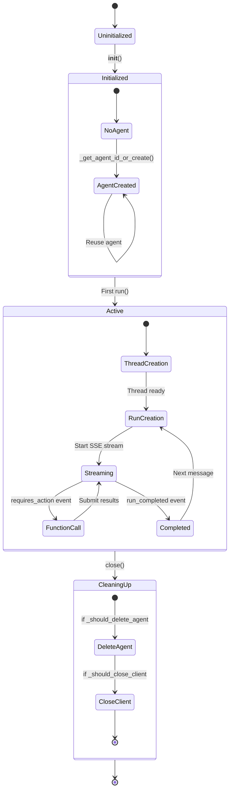
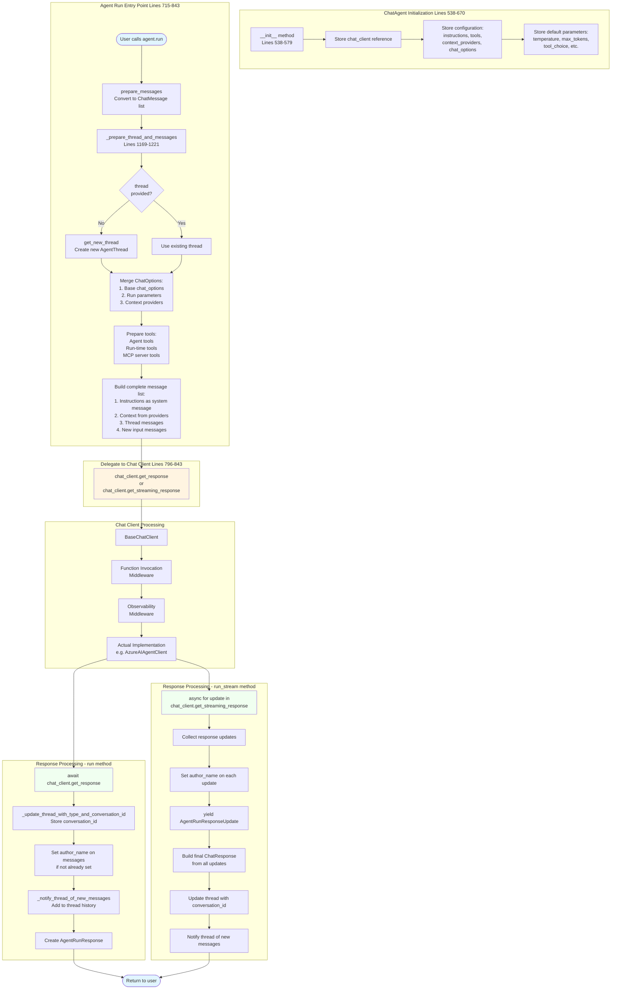
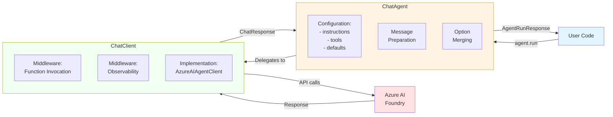
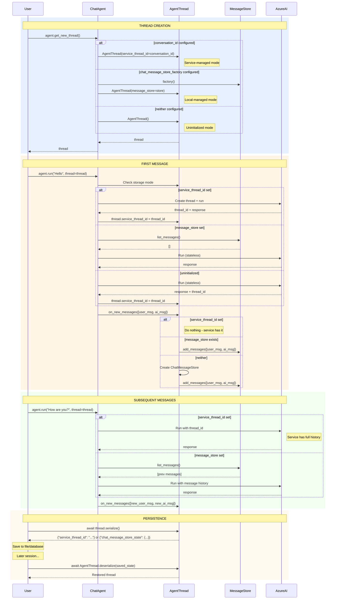
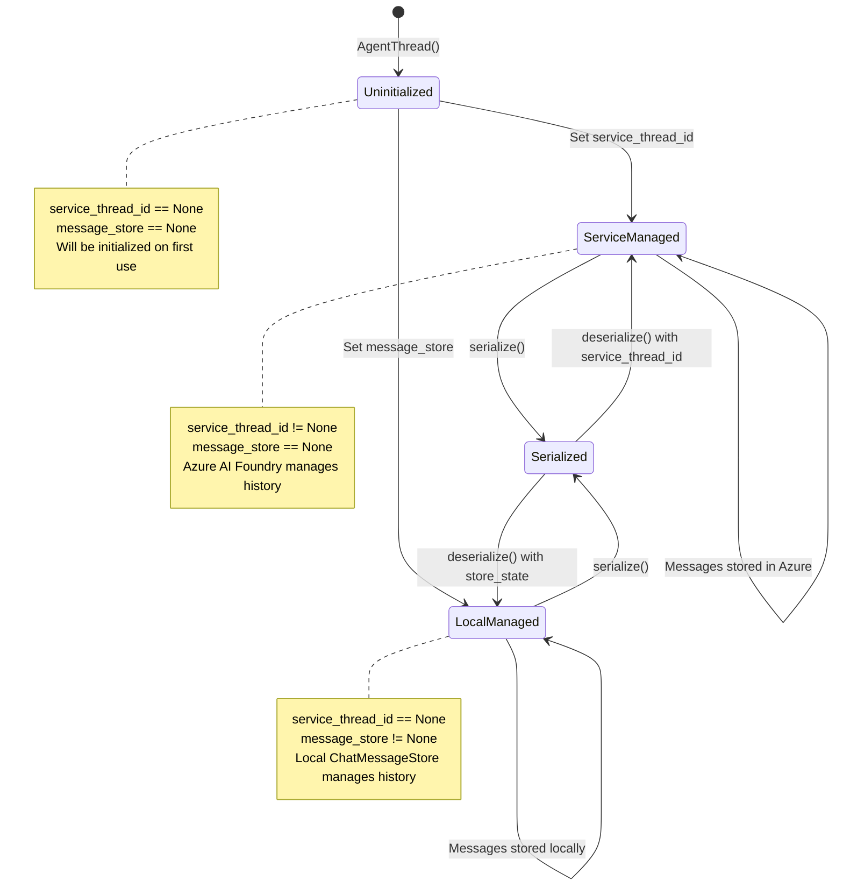

# AzureAIAgentClient Source Code Flow Diagram

This document provides a detailed mermaid diagram showing how the AzureAIAgentClient works internally, with source code references.

## Complete Flow Diagram

```mermaid
sequenceDiagram
    participant User
    participant ChatAgent
    participant AzureAIAgentClient
    participant AIProjectClient
    participant AzureAI as Azure AI Foundry Service
    
    %% Initialization Phase
    rect rgb(230, 240, 255)
        Note over User,AzureAI: INITIALIZATION PHASE
        User->>AzureAIAgentClient: __init__(project_endpoint, credential, model_deployment_name)
        Note right of AzureAIAgentClient: Lines 169-261<br/>_chat_client.py
        
        AzureAIAgentClient->>AzureAIAgentClient: Load AzureAISettings
        Note right of AzureAIAgentClient: Lines 220-228<br/>Priority: params > env vars > .env file
        
        alt No project_client provided
            AzureAIAgentClient->>AIProjectClient: Create AIProjectClient(endpoint, credential)
            Note right of AzureAIAgentClient: Lines 245-250<br/>should_close_client = True
        else project_client provided
            Note right of AzureAIAgentClient: Use existing client<br/>should_close_client = False
        end
        
        AzureAIAgentClient->>AzureAIAgentClient: Store state (project_client, agent_id, etc.)
        Note right of AzureAIAgentClient: Lines 252-261<br/>self.project_client = project_client<br/>self._should_delete_agent = False
    end
    
    %% Agent Creation Phase
    rect rgb(255, 245, 230)
        Note over User,AzureAI: AGENT CREATION PHASE
        User->>ChatAgent: ChatAgent(chat_client=AzureAIAgentClient, instructions, tools)
        ChatAgent->>ChatAgent: Store configuration
        ChatAgent->>User: Return agent instance
    end
    
    %% Thread Creation Phase
    rect rgb(240, 255, 240)
        Note over User,AzureAI: THREAD CREATION PHASE
        User->>ChatAgent: agent.get_new_thread()
        ChatAgent->>AzureAIAgentClient: Create new AgentThread
        AzureAIAgentClient->>User: Return thread object
        Note right of AzureAIAgentClient: Thread ID initially None<br/>Created on first run
    end
    
    %% Conversation Loop
    rect rgb(255, 250, 240)
        Note over User,AzureAI: CONVERSATION LOOP
        
        loop For each user message
            User->>ChatAgent: agent.run([user_prompt], thread=thread)
            
            %% Message Processing
            ChatAgent->>AzureAIAgentClient: _inner_get_streaming_response(messages, chat_options)
            Note right of AzureAIAgentClient: Lines 321-349<br/>Entry point for processing
            
            %% Create Run Options
            AzureAIAgentClient->>AzureAIAgentClient: _create_run_options(messages, chat_options)
            Note right of AzureAIAgentClient: Lines 668-843<br/>Convert messages & prepare options
            
            Note over AzureAIAgentClient: Process system messages → instructions<br/>Convert user/assistant messages<br/>Extract function results<br/>Prepare tool definitions
            
            %% Get or Create Agent
            AzureAIAgentClient->>AzureAIAgentClient: _get_agent_id_or_create(run_options)
            Note right of AzureAIAgentClient: Lines 351-380
            
            alt agent_id is None
                AzureAIAgentClient->>AIProjectClient: agents.create_agent(model, name, instructions, tools)
                Note right of AIProjectClient: POST /agents<br/>{"model": "gpt-4o-mini",<br/>"name": "expenses_agent",<br/>"instructions": "...",<br/>"tools": [...]}
                
                AIProjectClient->>AzureAI: HTTP POST Request
                AzureAI-->>AIProjectClient: {"id": "asst_abc123", ...}
                AIProjectClient-->>AzureAIAgentClient: created_agent
                
                AzureAIAgentClient->>AzureAIAgentClient: Store agent_id
                Note right of AzureAIAgentClient: self.agent_id = created_agent.id<br/>self._should_delete_agent = True
            else agent_id exists
                Note right of AzureAIAgentClient: Use existing agent_id
            end
            
            %% Create Agent Stream
            AzureAIAgentClient->>AzureAIAgentClient: _create_agent_stream(thread_id, agent_id, run_options)
            Note right of AzureAIAgentClient: Lines 382-432
            
            %% Check Active Run
            AzureAIAgentClient->>AIProjectClient: _get_active_thread_run(thread_id)
            Note right of AzureAIAgentClient: Lines 434-446
            AIProjectClient->>AzureAI: GET /threads/{thread_id}/runs?limit=1
            AzureAI-->>AIProjectClient: Active run or None
            
            %% Prepare Thread
            alt thread_id is None
                AzureAIAgentClient->>AIProjectClient: threads.create(tool_resources, metadata)
                Note right of AzureAIAgentClient: Lines 448-460<br/>Create new thread
                AIProjectClient->>AzureAI: POST /threads
                AzureAI-->>AIProjectClient: {"id": "thread_xyz789"}
                
                loop For each message in additional_messages
                    AzureAIAgentClient->>AIProjectClient: messages.create(thread_id, role, content)
                    AIProjectClient->>AzureAI: POST /threads/{thread_id}/messages
                end
            else thread_id exists and active run
                AzureAIAgentClient->>AIProjectClient: runs.cancel(thread_id, run_id)
                AIProjectClient->>AzureAI: POST /threads/{thread_id}/runs/{run_id}/cancel
            end
            
            %% Start Streaming Run
            AzureAIAgentClient->>AIProjectClient: runs.stream(thread_id, agent_id, **run_options)
            Note right of AIProjectClient: POST /threads/{thread_id}/runs<br/>Accept: text/event-stream<br/>{"agent_id": "...", "stream": true}
            
            AIProjectClient->>AzureAI: HTTP POST (SSE Stream)
            
            %% Process Stream Events
            AzureAIAgentClient->>AzureAIAgentClient: _process_stream(stream, thread_id)
            Note right of AzureAIAgentClient: Lines 462-615
            
            loop Process SSE Events
                AzureAI-->>AzureAIAgentClient: event: thread.run.created
                AzureAIAgentClient->>AzureAIAgentClient: Store response_id
                
                AzureAI-->>AzureAIAgentClient: event: thread.run.in_progress
                AzureAIAgentClient->>ChatAgent: yield ChatResponseUpdate(status)
                
                AzureAI-->>AzureAIAgentClient: event: thread.message.delta
                Note over AzureAI,AzureAIAgentClient: Streaming text chunks
                AzureAIAgentClient->>ChatAgent: yield ChatResponseUpdate(text="I'll")
                AzureAIAgentClient->>ChatAgent: yield ChatResponseUpdate(text=" send")
                
                alt AI needs to call function
                    AzureAI-->>AzureAIAgentClient: event: thread.run.requires_action
                    Note over AzureAI: {"required_action": {<br/>"type": "submit_tool_outputs",<br/>"tool_calls": [{<br/>"id": "call_123",<br/>"function": {<br/>"name": "send_email",<br/>"arguments": "{...}"<br/>}]}}
                    
                    AzureAIAgentClient->>AzureAIAgentClient: _create_function_call_contents(event_data)
                    Note right of AzureAIAgentClient: Lines 617-651<br/>Create FunctionCallContent
                    
                    AzureAIAgentClient->>ChatAgent: yield ChatResponseUpdate(contents=[FunctionCallContent])
                    
                    ChatAgent->>ChatAgent: Execute function locally
                    Note over ChatAgent: send_email(to="...", subject="...", body="...")
                    ChatAgent->>User: Print email details
                    
                    ChatAgent->>AzureAIAgentClient: Submit function results
                    Note right of ChatAgent: FunctionResultContent(call_id, result)
                    
                    AzureAIAgentClient->>AzureAIAgentClient: _convert_required_action_to_tool_output()
                    Note right of AzureAIAgentClient: Lines 899-938<br/>Convert to ToolOutput format
                    
                    AzureAIAgentClient->>AIProjectClient: runs.submit_tool_outputs_stream(thread_id, run_id, tool_outputs)
                    AIProjectClient->>AzureAI: POST /threads/{thread_id}/runs/{run_id}/submit_tool_outputs
                    
                    AzureAI-->>AzureAIAgentClient: Continue streaming with function results
                end
                
                AzureAI-->>AzureAIAgentClient: event: thread.message.delta
                AzureAIAgentClient->>ChatAgent: yield ChatResponseUpdate(text=" the email")
                
                AzureAI-->>AzureAIAgentClient: event: thread.run.completed
                Note over AzureAI: {"usage": {<br/>"prompt_tokens": 150,<br/>"completion_tokens": 80,<br/>"total_tokens": 230}}
                
                AzureAIAgentClient->>ChatAgent: yield ChatResponseUpdate(usage_content)
            end
            
            ChatAgent->>ChatAgent: Collect all updates into ChatResponse
            ChatAgent->>User: Return AgentRunResponse(text, messages)
        end
    end
    
    %% Cleanup Phase
    rect rgb(255, 240, 240)
        Note over User,AzureAI: CLEANUP PHASE
        User->>AzureAIAgentClient: __aexit__() or close()
        Note right of AzureAIAgentClient: Lines 283-293
        
        AzureAIAgentClient->>AzureAIAgentClient: _cleanup_agent_if_needed()
        Note right of AzureAIAgentClient: Lines 660-666
        
        alt _should_delete_agent is True
            AzureAIAgentClient->>AIProjectClient: agents.delete_agent(agent_id)
            AIProjectClient->>AzureAI: DELETE /agents/{agent_id}
            AzureAI-->>AIProjectClient: 204 No Content
        end
        
        AzureAIAgentClient->>AzureAIAgentClient: _close_client_if_needed()
        Note right of AzureAIAgentClient: Lines 653-657
        
        alt _should_close_client is True
            AzureAIAgentClient->>AIProjectClient: close()
            Note right of AIProjectClient: Close HTTP session<br/>Release connection pool<br/>Cleanup async resources
        end
    end
```



## Detailed Component Breakdown

### 1. Initialization (Lines 169-261)

```python
# _chat_client.py, lines 169-261
class AzureAIAgentClient(BaseChatClient):
    def __init__(
        self,
        *,
        project_client: AIProjectClient | None = None,
        agent_id: str | None = None,
        project_endpoint: str | None = None,
        model_deployment_name: str | None = None,
        async_credential: AsyncTokenCredential | None = None,
        **kwargs: Any,
    ) -> None:
        # Load settings from params, env vars, or .env file
        azure_ai_settings = AzureAISettings(
            project_endpoint=project_endpoint,
            model_deployment_name=model_deployment_name,
        )
        
        # Create AIProjectClient if not provided
        if project_client is None:
            project_client = AIProjectClient(
                endpoint=azure_ai_settings.project_endpoint,
                credential=async_credential,
                user_agent=AGENT_FRAMEWORK_USER_AGENT,
            )
            should_close_client = True
        
        # Store state
        self.project_client = project_client
        self.agent_id = agent_id
        self.model_id = azure_ai_settings.model_deployment_name
        self._should_delete_agent = False
        self._should_close_client = should_close_client
```

### 2. Message Processing Entry Point (Lines 321-349)

```python
# _chat_client.py, lines 321-349
async def _inner_get_streaming_response(
    self,
    *,
    messages: MutableSequence[ChatMessage],
    chat_options: ChatOptions,
    **kwargs: Any,
) -> AsyncIterable[ChatResponseUpdate]:
    # Convert messages to run options
    run_options, required_action_results = await self._create_run_options(
        messages, chat_options, **kwargs
    )
    
    # Get thread ID
    thread_id = chat_options.conversation_id or self.thread_id
    
    # Get or create agent
    agent_id = await self._get_agent_id_or_create(run_options)
    
    # Create and process stream
    async for update in self._process_stream(
        *(await self._create_agent_stream(
            thread_id, agent_id, run_options, required_action_results
        ))
    ):
        yield update
```

### 3. Agent Creation (Lines 351-380)

```python
# _chat_client.py, lines 351-380
async def _get_agent_id_or_create(
    self, run_options: dict[str, Any] | None = None
) -> str:
    if self.agent_id is None:
        # Create temporary agent
        agent_name = self.agent_name or "UnnamedAgent"
        args = {
            "model": run_options["model"],
            "name": agent_name,
        }
        if "tools" in run_options:
            args["tools"] = run_options["tools"]
        if "instructions" in run_options:
            args["instructions"] = run_options["instructions"]
        
        # API Call: POST /agents
        created_agent = await self.project_client.agents.create_agent(**args)
        
        self.agent_id = str(created_agent.id)
        self._should_delete_agent = True
    
    return self.agent_id
```

### 4. Thread Management (Lines 448-460)

```python
# _chat_client.py, lines 448-460
async def _prepare_thread(
    self, thread_id: str | None, thread_run: ThreadRun | None, run_options: dict[str, Any]
) -> str:
    if thread_id is not None:
        if thread_run is not None:
            # Cancel active run
            await self.project_client.agents.runs.cancel(thread_id, thread_run.id)
        return thread_id
    
    # API Call: POST /threads
    thread = await self.project_client.agents.threads.create(
        tool_resources=run_options.get("tool_resources"),
        metadata=run_options.get("metadata")
    )
    thread_id = thread.id
    
    # Add initial messages
    for msg in run_options.pop("additional_messages", []):
        # API Call: POST /threads/{thread_id}/messages
        await self.project_client.agents.messages.create(
            thread_id=thread_id,
            role=msg.role,
            content=msg.content,
            metadata=msg.metadata
        )
    
    return thread_id
```

### 5. Stream Creation and Processing (Lines 382-432, 462-615)

```python
# _chat_client.py, lines 382-432
async def _create_agent_stream(
    self,
    thread_id: str | None,
    agent_id: str,
    run_options: dict[str, Any],
    required_action_results: list[...] | None,
) -> tuple[AsyncAgentRunStream | AsyncAgentEventHandler, str]:
    # Check for active runs
    thread_run = await self._get_active_thread_run(thread_id)
    
    # Handle tool outputs if present
    if thread_run and tool_outputs:
        # API Call: POST /threads/{thread_id}/runs/{run_id}/submit_tool_outputs
        await self.project_client.agents.runs.submit_tool_outputs_stream(...)
    else:
        # Prepare thread
        final_thread_id = await self._prepare_thread(thread_id, thread_run, run_options)
        
        # API Call: POST /threads/{thread_id}/runs (with streaming)
        stream = await self.project_client.agents.runs.stream(
            final_thread_id,
            agent_id=agent_id,
            **run_options
        )
    
    return stream, final_thread_id

# _chat_client.py, lines 462-615
async def _process_stream(
    self, stream: AsyncAgentRunStream, thread_id: str
) -> AsyncIterable[ChatResponseUpdate]:
    response_stream = await stream.__aenter__()
    
    try:
        # Process Server-Sent Events
        async for event_type, event_data, _ in response_stream:
            match event_data:
                case MessageDeltaChunk():
                    # Streaming text from AI
                    yield ChatResponseUpdate(text=event_data.text, ...)
                
                case ThreadRun():
                    if event_type == AgentStreamEvent.THREAD_RUN_REQUIRES_ACTION:
                        # AI wants to call a function
                        contents = self._create_function_call_contents(event_data)
                        yield ChatResponseUpdate(contents=contents, ...)
                    
                    elif event_type == AgentStreamEvent.THREAD_RUN_FAILED:
                        raise ServiceResponseException(event_data.last_error.message)
    finally:
        await stream.__aexit__(None, None, None)
```

### 6. Function Call Processing (Lines 617-651, 899-938)

```python
# _chat_client.py, lines 617-651
def _create_function_call_contents(
    self, event_data: ThreadRun, response_id: str | None
) -> list[Contents]:
    if isinstance(event_data.required_action, SubmitToolOutputsAction):
        return [
            FunctionCallContent(
                call_id=f'["{response_id}", "{tool.id}"]',
                name=tool.function.name,
                arguments=tool.function.arguments,
            )
            for tool in event_data.required_action.submit_tool_outputs.tool_calls
        ]
    return []

# _chat_client.py, lines 899-938
def _convert_required_action_to_tool_output(
    self,
    required_action_results: list[FunctionResultContent] | None,
) -> tuple[str | None, list[ToolOutput] | None]:
    run_id = None
    tool_outputs = None
    
    if required_action_results:
        for content in required_action_results:
            # Extract run_id and call_id from stored call_id: [run_id, call_id]
            run_and_call_ids = json.loads(content.call_id)
            run_id = run_and_call_ids[0]
            call_id = run_and_call_ids[1]
            
            if tool_outputs is None:
                tool_outputs = []
            
            tool_outputs.append(
                ToolOutput(
                    tool_call_id=call_id,
                    output=prepare_function_call_results(content.result)
                )
            )
    
    return run_id, tool_outputs
```

### 7. Message Conversion (Lines 668-843)

```python
# _chat_client.py, lines 668-843
async def _create_run_options(
    self,
    messages: MutableSequence[ChatMessage],
    chat_options: ChatOptions | None,
    **kwargs: Any,
) -> tuple[dict[str, Any], list[FunctionResultContent] | None]:
    run_options = {**kwargs}
    
    # Set model and generation parameters
    if chat_options:
        run_options["model"] = chat_options.model_id or self.model_id
        run_options["max_completion_tokens"] = chat_options.max_tokens
        run_options["temperature"] = chat_options.temperature
        run_options["top_p"] = chat_options.top_p
        
        # Prepare tools
        if chat_options.tools:
            tool_definitions = await self._prep_tools(chat_options.tools, run_options)
            run_options["tools"] = tool_definitions
    
    instructions = []
    required_action_results = None
    additional_messages = []
    
    # Convert messages
    for chat_message in messages:
        if chat_message.role.value in ["system", "developer"]:
            # System messages → instructions
            for text_content in chat_message.contents:
                if isinstance(text_content, TextContent):
                    instructions.append(text_content.text)
        else:
            # Regular messages
            message_contents = []
            for content in chat_message.contents:
                if isinstance(content, TextContent):
                    message_contents.append(MessageInputTextBlock(text=content.text))
                elif isinstance(content, FunctionResultContent):
                    # Store function results separately
                    if required_action_results is None:
                        required_action_results = []
                    required_action_results.append(content)
            
            if message_contents:
                additional_messages.append(
                    ThreadMessageOptions(
                        role=MessageRole.AGENT if chat_message.role == Role.ASSISTANT else MessageRole.USER,
                        content=message_contents,
                    )
                )
    
    if additional_messages:
        run_options["additional_messages"] = additional_messages
    
    if instructions:
        run_options["instructions"] = "".join(instructions)
    
    return run_options, required_action_results
```

### 8. Cleanup (Lines 653-666)

```python
# _chat_client.py, lines 653-666
async def _close_client_if_needed(self) -> None:
    """Close project_client session if we created it."""
    if self._should_close_client:
        await self.project_client.close()

async def _cleanup_agent_if_needed(self) -> None:
    """Clean up the agent if we created it."""
    if self._should_delete_agent and self.agent_id is not None:
        # API Call: DELETE /agents/{agent_id}
        await self.project_client.agents.delete_agent(self.agent_id)
        self.agent_id = None
        self._should_delete_agent = False

async def close(self) -> None:
    """Close the project_client and clean up any agents we created."""
    await self._cleanup_agent_if_needed()
    await self._close_client_if_needed()
```

## Key Data Structures

### ThreadRun States
```python
RunStatus.QUEUED          # Run is queued
RunStatus.IN_PROGRESS     # Run is executing
RunStatus.REQUIRES_ACTION # Waiting for function results
RunStatus.COMPLETED       # Run finished successfully
RunStatus.FAILED          # Run encountered an error
RunStatus.CANCELLED       # Run was cancelled
RunStatus.EXPIRED         # Run timed out
```

### Server-Sent Event Types
```python
AgentStreamEvent.THREAD_RUN_CREATED           # Run started
AgentStreamEvent.THREAD_RUN_IN_PROGRESS       # Run executing
AgentStreamEvent.THREAD_RUN_REQUIRES_ACTION   # Function call needed
AgentStreamEvent.THREAD_RUN_COMPLETED         # Run finished
AgentStreamEvent.THREAD_RUN_FAILED            # Run failed
AgentStreamEvent.THREAD_MESSAGE_DELTA         # Streaming text chunk
AgentStreamEvent.THREAD_RUN_STEP_CREATED      # Step started
AgentStreamEvent.THREAD_RUN_STEP_COMPLETED    # Step finished
```

## API Endpoints Used

| Endpoint | Method | Purpose | Source Line |
|----------|--------|---------|-------------|
| `/agents` | POST | Create agent | 374-376 |
| `/agents/{agent_id}` | DELETE | Delete agent | 663 |
| `/threads` | POST | Create thread | 457-459 |
| `/threads/{thread_id}/messages` | POST | Add message | 464-467 |
| `/threads/{thread_id}/runs` | GET | List runs | 437-441 |
| `/threads/{thread_id}/runs` | POST | Create run (streaming) | 427-429 |
| `/threads/{thread_id}/runs/{run_id}/cancel` | POST | Cancel run | 453 |
| `/threads/{thread_id}/runs/{run_id}/submit_tool_outputs` | POST | Submit function results | 413-416 |

## Connection Lifecycle Summary



---

# ChatAgent Source Code Flow Diagram

This section provides a detailed mermaid diagram showing how the ChatAgent orchestrates the conversation flow and delegates to the chat client.

## ChatAgent Complete Flow Diagram



## ChatAgent Initialization Deep Dive

```python
# agent_framework/_agents.py, lines 538-670
@use_agent_middleware
@use_agent_observability
class ChatAgent(BaseAgent):
    """A Chat Client Agent.
    
    This is the primary agent implementation that uses a chat client to interact
    with language models. It supports tools, context providers, middleware, and
    both streaming and non-streaming responses.
    """
    
    AGENT_SYSTEM_NAME: ClassVar[str] = "microsoft.agent_framework"
    
    def __init__(
        self,
        chat_client: ChatClientProtocol,  # The actual connection (e.g., AzureAIAgentClient)
        instructions: str | None = None,   # System prompt
        *,
        id: str | None = None,             # Unique identifier
        name: str | None = None,           # Display name
        description: str | None = None,
        chat_message_store_factory: Callable[[], ChatMessageStoreProtocol] | None = None,
        conversation_id: str | None = None,
        context_providers: ContextProvider | list[ContextProvider] | None = None,
        middleware: Middleware | list[Middleware] | None = None,
        # Default chat parameters
        frequency_penalty: float | None = None,
        logit_bias: dict[str | int, float] | None = None,
        max_tokens: int | None = None,
        metadata: dict[str, Any] | None = None,
        model_id: str | None = None,
        presence_penalty: float | None = None,
        response_format: type[BaseModel] | None = None,
        seed: int | None = None,
        stop: str | Sequence[str] | None = None,
        store: bool | None = None,
        temperature: float | None = None,
        tool_choice: ToolMode | Literal["auto", "required", "none"] | dict[str, Any] | None = "auto",
        tools: ToolProtocol | Callable | list[...] | None = None,
        top_p: float | None = None,
        user: str | None = None,
        additional_chat_options: dict[str, Any] | None = None,
        **kwargs: Any,
    ) -> None:
        # Initialize parent BaseAgent
        super().__init__(
            id=id,
            name=name,
            description=description,
            context_providers=context_providers,
            middleware=middleware,
            **kwargs,
        )
        
        # Store the chat client (connection to AI service)
        self.chat_client = chat_client
        
        # Store instructions (system prompt)
        self.instructions = instructions
        
        # Process and store tools
        agent_tools = []
        if tools:
            # Convert various tool formats to ToolProtocol
            # ... tool processing logic
        
        # Create ChatOptions with all default parameters
        self.chat_options = ChatOptions(
            model_id=model_id,
            frequency_penalty=frequency_penalty,
            logit_bias=logit_bias,
            max_tokens=max_tokens,
            metadata=metadata,
            presence_penalty=presence_penalty,
            response_format=response_format,
            seed=seed,
            stop=stop,
            store=store,
            temperature=temperature,
            tool_choice=tool_choice,
            tools=agent_tools,
            top_p=top_p,
            user=user,
            additional_properties=additional_chat_options or {},
        )
        
        self._async_exit_stack = AsyncExitStack()
        self._update_agent_name()
```

## ChatAgent run() Method Flow

```python
# agent_framework/_agents.py, lines 715-843
async def run(
    self,
    messages: str | ChatMessage | list[str] | list[ChatMessage] | None = None,
    *,
    thread: AgentThread | None = None,
    # All chat parameters can override defaults
    frequency_penalty: float | None = None,
    logit_bias: dict[str | int, float] | None = None,
    max_tokens: int | None = None,
    metadata: dict[str, Any] | None = None,
    model_id: str | None = None,
    presence_penalty: float | None = None,
    response_format: type[BaseModel] | None = None,
    seed: int | None = None,
    stop: str | Sequence[str] | None = None,
    store: bool | None = None,
    temperature: float | None = None,
    tool_choice: ToolMode | Literal["auto", "required", "none"] | dict[str, Any] | None = None,
    tools: ToolProtocol | Callable | list[...] | None = None,
    top_p: float | None = None,
    user: str | None = None,
    additional_chat_options: dict[str, Any] | None = None,
    **kwargs: Any,
) -> AgentRunResponse:
    """Run the agent with the given messages and options."""
    
    # Step 1: Convert input to list of ChatMessage objects
    input_messages = prepare_messages(messages)
    
    # Step 2: Prepare thread and merge all configuration
    thread, run_chat_options, thread_messages = await self._prepare_thread_and_messages(
        thread=thread,
        input_messages=input_messages,
    )
    
    # Step 3: Prepare tools (agent tools + run-time tools + MCP servers)
    final_tools = []
    if tools:
        # Add run-time tools
        final_tools.extend(self._process_tools(tools))
    if self.chat_options.tools:
        # Add agent-level tools
        final_tools.extend(self.chat_options.tools)
    
    # Connect to MCP servers if needed
    for mcp_server in self._local_mcp_tools:
        if not mcp_server.is_connected:
            await self._async_exit_stack.enter_async_context(mcp_server)
        final_tools.extend(mcp_server.functions)
    
    # Step 4: Merge all ChatOptions (defaults + run params)
    co = run_chat_options & ChatOptions(
        conversation_id=thread.service_thread_id,
        frequency_penalty=frequency_penalty,
        logit_bias=logit_bias,
        max_tokens=max_tokens,
        metadata=metadata,
        model_id=model_id,
        presence_penalty=presence_penalty,
        response_format=response_format,
        seed=seed,
        stop=stop,
        store=store,
        temperature=temperature,
        tool_choice=tool_choice,
        tools=final_tools,
        top_p=top_p,
        user=user,
        **(additional_chat_options or {}),
    )
    
    # Step 5: Call the chat client (delegates to AzureAIAgentClient, etc.)
    response = await self.chat_client.get_response(
        messages=thread_messages,
        chat_options=co,
        **kwargs
    )
    
    # Step 6: Update thread with conversation ID from response
    await self._update_thread_with_type_and_conversation_id(
        thread, response.conversation_id
    )
    
    # Step 7: Set author name on response messages
    agent_name = self._get_agent_name()
    for message in response.messages:
        if message.author_name is None:
            message.author_name = agent_name
    
    # Step 8: Notify thread of new messages (adds to history)
    await self._notify_thread_of_new_messages(
        thread, input_messages, response.messages
    )
    
    # Step 9: Create and return AgentRunResponse
    return AgentRunResponse(
        messages=response.messages,
        response_id=response.response_id,
        created_at=response.created_at,
        usage_details=response.usage_details,
        value=response.value,
        raw_representation=response,
        additional_properties=response.additional_properties,
    )
```

## ChatAgent run_stream() Method Flow

```python
# agent_framework/_agents.py, lines 844-974
async def run_stream(
    self,
    messages: str | ChatMessage | list[str] | list[ChatMessage] | None = None,
    *,
    thread: AgentThread | None = None,
    # Same parameters as run()...
    **kwargs: Any,
) -> AsyncIterable[AgentRunResponseUpdate]:
    """Stream the agent with the given messages and options."""
    
    # Steps 1-4: Same preparation as run() method
    input_messages = prepare_messages(messages)
    thread, run_chat_options, thread_messages = await self._prepare_thread_and_messages(
        thread=thread,
        input_messages=input_messages,
    )
    
    # Prepare tools and merge options (same as run())
    final_tools = [...]
    co = run_chat_options & ChatOptions(...)
    
    agent_name = self._get_agent_name()
    response_updates: list[ChatResponseUpdate] = []
    
    # Step 5: Stream from chat client
    async for update in self.chat_client.get_streaming_response(
        messages=thread_messages,
        chat_options=co,
        **kwargs
    ):
        # Collect updates for final response
        response_updates.append(update)
        
        # Set author name if not present
        if update.author_name is None:
            update.author_name = agent_name
        
        # Step 6: Yield update to caller (streaming!)
        yield AgentRunResponseUpdate(
            contents=update.contents,
            role=update.role,
            author_name=update.author_name,
            response_id=update.response_id,
            message_id=update.message_id,
            created_at=update.created_at,
            additional_properties=update.additional_properties,
            raw_representation=update,
        )
    
    # Step 7: After streaming completes, build final response
    response = ChatResponse.from_chat_response_updates(
        response_updates,
        output_format_type=co.response_format
    )
    
    # Step 8: Update thread and notify of new messages
    await self._update_thread_with_type_and_conversation_id(
        thread, response.conversation_id
    )
    await self._notify_thread_of_new_messages(
        thread, input_messages, response.messages
    )
```

## Thread and Message Preparation

```python
# agent_framework/_agents.py, lines 1169-1221
async def _prepare_thread_and_messages(
    self,
    *,
    thread: AgentThread | None,
    input_messages: list[ChatMessage] | None = None,
) -> tuple[AgentThread, ChatOptions, list[ChatMessage]]:
    """Prepare the thread and messages for agent execution.
    
    This method:
    1. Creates or validates the thread
    2. Merges context provider data
    3. Assembles the complete message list
    """
    
    # Start with a copy of agent's chat options
    chat_options = copy(self.chat_options) if self.chat_options else ChatOptions()
    
    # Get or create thread
    thread = thread or self.get_new_thread()
    
    # If thread has a service thread ID, merge context from providers
    if thread.service_thread_id and thread.context_provider:
        context = await thread.context_provider.get_context()
        
        # Merge context into chat options
        if context.chat_options:
            chat_options = chat_options & context.chat_options
    
    # Build the complete message list
    thread_messages: list[ChatMessage] = []
    
    # 1. Add instructions as system message
    if self.instructions:
        thread_messages.append(
            ChatMessage(role=Role.SYSTEM, text=self.instructions)
        )
    
    # 2. Add context messages from providers
    if thread.context_provider:
        context = await thread.context_provider.get_context()
        if context.messages:
            thread_messages.extend(context.messages)
    
    # 3. Add existing messages from thread history
    if not thread.service_thread_id:
        # For in-memory threads, get messages from message store
        async for message in thread.get_messages():
            thread_messages.append(message)
    # For service-managed threads (Azure AI), history is managed server-side
    
    # 4. Add new input messages
    if input_messages:
        thread_messages.extend(input_messages)
    
    return thread, chat_options, thread_messages
```

## Key Data Flow Summary



## ChatAgent vs AzureAIAgentClient Responsibility Split

| Aspect | ChatAgent | AzureAIAgentClient |
|--------|-----------|-------------------|
| **Purpose** | High-level orchestration | Low-level Azure AI communication |
| **Responsibilities** | • Message preparation<br/>• Thread management<br/>• Tool coordination<br/>• Context providers<br/>• Middleware execution<br/>• Response formatting | • Azure authentication<br/>• Agent creation/deletion<br/>• Thread creation<br/>• API request formatting<br/>• Streaming protocol (SSE)<br/>• Function call handling |
| **State Management** | • Chat options<br/>• Tools<br/>• Instructions<br/>• Context providers | • Project client<br/>• Agent ID<br/>• Thread ID<br/>• Cleanup flags |
| **Message Flow** | Inbound: User → ChatMessage<br/>Outbound: ChatResponse → AgentRunResponse | Inbound: ChatMessage → Azure format<br/>Outbound: Azure SSE → ChatResponseUpdate |
| **Source Location** | `agent_framework/_agents.py`<br/>Lines 473-1231 | `agent_framework_azure_ai/_chat_client.py`<br/>Lines 146-938 |

## Complete Integration Example

```python
# Your application code
async def main():
    # 1. Create the chat client (connection layer)
    chat_client = AzureAIAgentClient(
        project_endpoint=os.getenv("AZURE_AI_PROJECT_ENDPOINT"),
        model_deployment_name=os.getenv("AZURE_AI_MODEL_DEPLOYMENT_NAME"),
        async_credential=AzureCliCredential(),
    )
    
    # 2. Create the agent (orchestration layer)
    agent = ChatAgent(
        chat_client=chat_client,  # Delegates to this
        name="expenses_agent",
        instructions="You are an AI assistant for expense claims...",
        tools=send_email,          # Agent manages tools
        temperature=0.7,            # Default chat options
    )
    
    # 3. Get a conversation thread
    thread = agent.get_new_thread()
    
    # 4. Run the agent
    response = await agent.run(
        messages="Submit my expense claim",
        thread=thread,
        # Can override defaults per call
        temperature=0.5,
    )
    
    # Flow:
    # agent.run() 
    #   → ChatAgent prepares messages & options
    #   → chat_client.get_response()
    #     → AzureAIAgentClient formats for Azure API
    #     → Makes HTTP request to Azure AI Foundry
    #     → Processes streaming response
    #     → Handles function calls
    #   → ChatAgent updates thread
    #   → Returns AgentRunResponse to user
```

---

# AgentThread Source Code Flow Diagram

This section provides a detailed mermaid diagram showing how AgentThread manages conversation state and message history.

## AgentThread Complete Flow Diagram

```mermaid
flowchart TD
    Start([Create AgentThread])
    
    subgraph Init1 ["AgentThread Initialization Lines 323-346"]
        InitCheck{Which storage<br/>mode?}
        ServiceMode["Service-Managed Thread<br/>service_thread_id provided"]
        LocalMode["Local Message Store<br/>message_store provided"]
        EmptyMode["Uninitialized<br/>No storage yet"]
        
        ValidateExclusive["Validate: Cannot have both<br/>service_thread_id AND message_store"]
        StoreServiceID["Store _service_thread_id"]
        StoreMessageStore["Store _message_store"]
        StoreContextProvider["Store context_provider"]
        
        Start --> InitCheck
        InitCheck -->|service_thread_id| ServiceMode
        InitCheck -->|message_store| LocalMode
        InitCheck -->|neither| EmptyMode
        
        ServiceMode --> ValidateExclusive
        LocalMode --> ValidateExclusive
        EmptyMode --> ValidateExclusive
        
        ValidateExclusive --> StoreServiceID
        ValidateExclusive --> StoreMessageStore
        ValidateExclusive --> StoreContextProvider
    end
    
    subgraph Props1 ["Property Access Lines 347-398"]
        GetServiceID["service_thread_id property<br/>Returns _service_thread_id"]
        SetServiceID["service_thread_id setter<br/>Lines 360-378"]
        CheckMessageStore{message_store<br/>exists?}
        RaiseError1["Raise AgentThreadException<br/>Cannot have both"]
        
        GetMessageStore["message_store property<br/>Returns _message_store"]
        SetMessageStore["message_store setter<br/>Lines 381-398"]
        CheckServiceID{service_thread_id<br/>exists?}
        RaiseError2["Raise AgentThreadException<br/>Cannot have both"]
        
        SetServiceID --> CheckMessageStore
        CheckMessageStore -->|Yes| RaiseError1
        CheckMessageStore -->|No| StoreServiceID
        
        SetMessageStore --> CheckServiceID
        CheckServiceID -->|Yes| RaiseError2
        CheckServiceID -->|No| StoreMessageStore
    end
    
    subgraph Messages1 ["Message Handling Lines 400-418"]
        OnNewMessages["on_new_messages<br/>Called when messages arrive"]
        CheckStorage{Storage type?}
        ServiceManaged["service_thread_id set<br/>Do nothing - service handles it"]
        CreateStore{message_store<br/>exists?}
        CreateDefault["Create default ChatMessageStore"]
        AddMessages["await message_store.add_messages"]
        
        OnNewMessages --> CheckStorage
        CheckStorage -->|Service ID| ServiceManaged
        CheckStorage -->|Local Store| CreateStore
        CreateStore -->|No| CreateDefault
        CreateStore -->|Yes| AddMessages
        CreateDefault --> AddMessages
    end
    
    subgraph Serialization1 ["Serialization Lines 419-441"]
        Serialize["serialize method<br/>Export thread state"]
        CheckStoreForSer{message_store<br/>exists?}
        SerializeStore["await message_store.serialize"]
        CreateState["Create AgentThreadState<br/>with service_thread_id or store_state"]
        ReturnDict["Return state.model_dump"]
        
        Serialize --> CheckStoreForSer
        CheckStoreForSer -->|Yes| SerializeStore
        CheckStoreForSer -->|No| CreateState
        SerializeStore --> CreateState
        CreateState --> ReturnDict
    end
    
    subgraph Deserialization1 ["Deserialization Lines 442-476"]
        Deserialize["deserialize classmethod<br/>Restore from state"]
        ParseState["Parse AgentThreadState<br/>from dictionary"]
        CheckStateType{What's in<br/>the state?}
        
        HasServiceID["service_thread_id present<br/>Return AgentThread with ID"]
        NoStoreState["No store state<br/>Return empty AgentThread"]
        HasStoreState["chat_message_store_state present"]
        
        CheckCustomStore{Custom<br/>message_store<br/>provided?}
        UseCustomStore["Update custom store<br/>from state"]
        CreateDefaultStore["Create ChatMessageStore<br/>from state"]
        ReturnThread["Return new AgentThread"]
        
        Deserialize --> ParseState
        ParseState --> CheckStateType
        CheckStateType -->|service_thread_id| HasServiceID
        CheckStateType -->|empty| NoStoreState
        CheckStateType -->|store_state| HasStoreState
        
        HasStoreState --> CheckCustomStore
        CheckCustomStore -->|Yes| UseCustomStore
        CheckCustomStore -->|No| CreateDefaultStore
        UseCustomStore --> ReturnThread
        CreateDefaultStore --> ReturnThread
        HasServiceID --> ReturnThread
        NoStoreState --> ReturnThread
    end
    
    subgraph Update1 ["Update From State Lines 481-506"]
        UpdateState["update_from_thread_state<br/>Update existing thread"]
        ParseUpdate["Parse AgentThreadState"]
        CheckUpdateType{What's in<br/>the state?}
        
        UpdateServiceID["Set service_thread_id property<br/>Clear message_store"]
        NoUpdate["No state to update<br/>Return"]
        UpdateStore{message_store<br/>exists?}
        UpdateExisting["Update existing store<br/>from state"]
        CreateNewStore["Create new ChatMessageStore<br/>from state"]
        
        UpdateState --> ParseUpdate
        ParseUpdate --> CheckUpdateType
        CheckUpdateType -->|service_thread_id| UpdateServiceID
        CheckUpdateType -->|empty| NoUpdate
        CheckUpdateType -->|store_state| UpdateStore
        
        UpdateStore -->|Yes| UpdateExisting
        UpdateStore -->|No| CreateNewStore
    end
    
    StoreContextProvider --> End([Thread Ready])
    ReturnThread --> End
    AddMessages --> End
    ReturnDict --> End
    UpdateServiceID --> End
    UpdateExisting --> End
    CreateNewStore --> End
    NoUpdate --> End
    
    style Start fill:#e1f5ff
    style End fill:#e1f5ff
    style RaiseError1 fill:#ffe1e1
    style RaiseError2 fill:#ffe1e1
    style ValidateExclusive fill:#fff4e1
```



## AgentThread Initialization Deep Dive

```python
# agent_framework/_threads.py, lines 323-346
class AgentThread:
    """The Agent thread class for managing conversation state.
    
    This can represent either:
    1. A service-managed thread (Azure AI Foundry manages history)
    2. A locally-managed thread (messages stored in ChatMessageStore)
    """
    
    def __init__(
        self,
        *,
        service_thread_id: str | None = None,
        message_store: ChatMessageStoreProtocol | None = None,
        context_provider: AggregateContextProvider | None = None,
    ) -> None:
        """Initialize an AgentThread.
        
        IMPORTANT: Do not use this method manually!
        Always use: agent.get_new_thread()
        
        Args:
            service_thread_id: The optional ID of the thread managed by the agent service.
                When set, Azure AI Foundry stores the conversation history.
            message_store: The optional ChatMessageStore for managing chat messages locally.
            context_provider: The optional ContextProvider for the thread.
        
        Note:
            Either service_thread_id or message_store may be set, but not both.
            This is enforced to prevent confusion about where messages are stored.
        """
        # CRITICAL VALIDATION: Prevent both storage modes simultaneously
        if service_thread_id is not None and message_store is not None:
            raise AgentThreadException(
                "Only the service_thread_id or message_store may be set, but not both."
            )
        
        # Store the configuration
        self._service_thread_id = service_thread_id
        self._message_store = message_store
        self.context_provider = context_provider
```

## Property Management with Mutual Exclusion

```python
# agent_framework/_threads.py, lines 347-398

@property
def is_initialized(self) -> bool:
    """Indicates if the thread is initialized.
    
    This means either the service_thread_id or the message_store is set.
    """
    return self._service_thread_id is not None or self._message_store is not None

@property
def service_thread_id(self) -> str | None:
    """Gets the ID of the current thread managed by the agent service."""
    return self._service_thread_id

@service_thread_id.setter
def service_thread_id(self, service_thread_id: str | None) -> None:
    """Sets the ID for service-managed thread.
    
    This property is set by AzureAIAgentClient after creating a thread
    in Azure AI Foundry service.
    
    Note:
        Either service_thread_id or message_store may be set, but not both.
    """
    if service_thread_id is None:
        return
    
    # CRITICAL: Prevent switching from local to service storage
    if self._message_store is not None:
        raise AgentThreadException(
            "Only the service_thread_id or message_store may be set, "
            "but not both and switching from one to another is not supported."
        )
    self._service_thread_id = service_thread_id

@property
def message_store(self) -> ChatMessageStoreProtocol | None:
    """Gets the ChatMessageStoreProtocol used by this thread."""
    return self._message_store

@message_store.setter
def message_store(self, message_store: ChatMessageStoreProtocol | None) -> None:
    """Sets the ChatMessageStore for local message storage.
    
    This is typically set automatically when the agent creates a new thread
    with a chat_message_store_factory configured.
    
    Note:
        Either service_thread_id or message_store may be set, but not both.
    """
    if message_store is None:
        return
    
    # CRITICAL: Prevent switching from service to local storage
    if self._service_thread_id is not None:
        raise AgentThreadException(
            "Only the service_thread_id or message_store may be set, "
            "but not both and switching from one to another is not supported."
        )
    
    self._message_store = message_store
```

## Message Handling

```python
# agent_framework/_threads.py, lines 400-418
async def on_new_messages(
    self, new_messages: ChatMessage | Sequence[ChatMessage]
) -> None:
    """Invoked when new messages are added to the conversation.
    
    This is called by ChatAgent after receiving responses from the AI.
    
    Args:
        new_messages: The new ChatMessage or sequence of messages to add.
    """
    # Service-managed threads: Do nothing locally
    if self._service_thread_id is not None:
        # If the thread messages are stored in the service there is nothing
        # to do here, since invoking the service already updated the thread.
        return
    
    # Local storage: Ensure we have a message store
    if self._message_store is None:
        # If there is no conversation id and no store, we can
        # create a default in-memory store.
        self._message_store = ChatMessageStore()
    
    # Add messages to the store
    if isinstance(new_messages, ChatMessage):
        new_messages = [new_messages]
    await self._message_store.add_messages(new_messages)
```

## Serialization for State Persistence

```python
# agent_framework/_threads.py, lines 419-441
async def serialize(self, **kwargs: Any) -> dict[str, Any]:
    """Serializes the current thread state to a dictionary.
    
    This allows saving thread state to disk or database for later restoration.
    
    Keyword Args:
        **kwargs: Arguments passed to message_store.serialize if applicable.
    
    Returns:
        Dictionary containing either:
        - service_thread_id (for service-managed threads)
        - chat_message_store_state (for locally-managed threads)
    """
    chat_message_store_state = None
    
    # If we have a local message store, serialize its contents
    if self._message_store is not None:
        chat_message_store_state = await self._message_store.serialize(**kwargs)
    
    # Create state object
    state = AgentThreadState(
        service_thread_id=self._service_thread_id,
        chat_message_store_state=chat_message_store_state
    )
    
    # Return as dictionary
    return state.model_dump()
```

## Deserialization for State Restoration

```python
# agent_framework/_threads.py, lines 442-476
@classmethod
async def deserialize(
    cls: type[TAgentThread],
    serialized_thread_state: dict[str, Any],
    *,
    message_store: ChatMessageStoreProtocol | None = None,
    **kwargs: Any,
) -> TAgentThread:
    """Deserializes state from a dictionary into a new AgentThread.
    
    This restores a thread from previously saved state.
    
    Args:
        serialized_thread_state: The serialized thread state as a dictionary.
    
    Keyword Args:
        message_store: Optional custom ChatMessageStore to use.
            If not provided, a default ChatMessageStore will be created.
        **kwargs: Additional arguments for deserialization.
    
    Returns:
        A new AgentThread instance with restored state.
    """
    # Parse the state
    state = AgentThreadState.model_validate(serialized_thread_state)
    
    # Case 1: Service-managed thread
    if state.service_thread_id is not None:
        return cls(service_thread_id=state.service_thread_id)
    
    # Case 2: Empty thread (no state to restore)
    if state.chat_message_store_state is None:
        return cls()
    
    # Case 3: Locally-managed thread with message history
    if message_store is not None:
        # Use provided custom message store
        try:
            await message_store.update_from_state(
                state.chat_message_store_state, **kwargs
            )
        except Exception as ex:
            raise AgentThreadException(
                "Failed to deserialize the provided message store."
            ) from ex
        return cls(message_store=message_store)
    
    # Create default ChatMessageStore from state
    try:
        message_store = await ChatMessageStore.deserialize(
            state.chat_message_store_state, **kwargs
        )
    except Exception as ex:
        raise AgentThreadException(
            "Failed to deserialize the message store."
        ) from ex
    
    return cls(message_store=message_store)
```

## Update Existing Thread From State

```python
# agent_framework/_threads.py, lines 481-506
async def update_from_thread_state(
    self,
    serialized_thread_state: dict[str, Any],
    **kwargs: Any,
) -> None:
    """Updates an existing thread with state from a dictionary.
    
    This is useful for updating thread state without creating a new instance.
    
    Args:
        serialized_thread_state: The serialized thread state as a dictionary.
    
    Keyword Args:
        **kwargs: Additional arguments for deserialization.
    """
    # Parse the state
    state = AgentThreadState.model_validate(serialized_thread_state)
    
    # Case 1: Update to service-managed thread
    if state.service_thread_id is not None:
        self.service_thread_id = state.service_thread_id
        # Since we have an ID, we should not have a chat message store
        return
    
    # Case 2: No state to update
    if state.chat_message_store_state is None:
        return
    
    # Case 3: Update local message store
    if self.message_store is not None:
        # Update existing message store from state
        await self.message_store.update_from_state(
            state.chat_message_store_state, **kwargs
        )
        return
    
    # Create new message store from state
    self.message_store = await ChatMessageStore.deserialize(
        state.chat_message_store_state, **kwargs
    )
```

## Storage Mode Comparison

```mermaid
graph TB
    subgraph ServiceManaged ["Service-Managed Thread"]
        SM1["service_thread_id = 'thread_abc123'"]
        SM2["message_store = None"]
        SM3["Azure AI Foundry stores history"]
        SM4["on_new_messages does nothing"]
        SM5["Survives across sessions"]
        
        SM1 --> SM2 --> SM3 --> SM4 --> SM5
    end
    
    subgraph LocalManaged ["Locally-Managed Thread"]
        LM1["service_thread_id = None"]
        LM2["message_store = ChatMessageStore"]
        LM3["Local Python stores history"]
        LM4["on_new_messages adds to store"]
        LM5["Must serialize/deserialize for persistence"]
        
        LM1 --> LM2 --> LM3 --> LM4 --> LM5
    end
    
    subgraph Uninitialized ["Uninitialized Thread"]
        UN1["service_thread_id = None"]
        UN2["message_store = None"]
        UN3["No history yet"]
        UN4["Will be initialized on first run"]
        UN5["Agent decides storage mode"]
        
        UN1 --> UN2 --> UN3 --> UN4 --> UN5
    end
    
    style ServiceManaged fill:#e1f5ff
    style LocalManaged fill:#f0fff0
    style Uninitialized fill:#fff4e1
```



## Thread Lifecycle with ChatAgent



## Key Design Patterns

### 1. Mutual Exclusion Pattern
```python
# Either service_thread_id OR message_store, never both
if service_thread_id is not None and message_store is not None:
    raise AgentThreadException("Only one storage mode allowed")
```

### 2. Lazy Initialization Pattern
```python
# Create message store only when needed
if self._message_store is None:
    self._message_store = ChatMessageStore()
```

### 3. Storage Mode Detection Pattern
```python
# Check which storage mode is active
if self._service_thread_id is not None:
    # Service-managed mode
elif self._message_store is not None:
    # Local-managed mode
else:
    # Uninitialized mode
```

## AgentThread State Transitions



## Complete Integration Example

```python
# Example 1: Service-Managed Thread (Azure AI Foundry stores history)
from agent_framework import ChatAgent
from agent_framework.azure import AzureAIAgentClient
from azure.identity.aio import AzureCliCredential

async def service_managed_example():
    # Create chat client
    chat_client = AzureAIAgentClient(
        project_endpoint=os.getenv("AZURE_AI_PROJECT_ENDPOINT"),
        model_deployment_name="gpt-4o",
        async_credential=AzureCliCredential(),
    )
    
    # Create agent with conversation_id (will use service storage)
    agent = ChatAgent(
        chat_client=chat_client,
        name="assistant",
        conversation_id="my-persistent-conversation"  # Service-managed
    )
    
    # Get thread (will have service_thread_id set)
    thread = agent.get_new_thread()
    assert thread.service_thread_id == "my-persistent-conversation"
    assert thread.message_store is None
    
    # First message
    response1 = await agent.run("Hello!", thread=thread)
    # Azure AI Foundry automatically stores this in the thread
    
    # Second message - history is automatically included
    response2 = await agent.run("What did I say?", thread=thread)
    # Response: "You said 'Hello!'"


# Example 2: Locally-Managed Thread (Python stores history)
async def local_managed_example():
    from agent_framework import ChatMessageStore
    
    chat_client = AzureAIAgentClient(...)
    
    # Create agent with message store factory
    agent = ChatAgent(
        chat_client=chat_client,
        name="assistant",
        chat_message_store_factory=ChatMessageStore  # Local storage
    )
    
    # Get thread (will have message_store set)
    thread = agent.get_new_thread()
    assert thread.service_thread_id is None
    assert thread.message_store is not None
    
    # First message
    response1 = await agent.run("Hello!", thread=thread)
    # ChatAgent calls thread.on_new_messages() which adds to message_store
    
    # Second message - agent reads from message_store
    response2 = await agent.run("What did I say?", thread=thread)
    
    # Serialize for persistence
    state = await thread.serialize()
    # Save to file: json.dump(state, file)
    
    # Later: restore from file
    # state = json.load(file)
    # restored_thread = await AgentThread.deserialize(state)


# Example 3: Uninitialized Thread (Determined on first use)
async def uninitialized_example():
    chat_client = AzureAIAgentClient(...)
    
    # Agent with NO conversation_id and NO chat_message_store_factory
    agent = ChatAgent(
        chat_client=chat_client,
        name="assistant",
        # No storage configured
    )
    
    # Get thread (uninitialized)
    thread = agent.get_new_thread()
    assert thread.service_thread_id is None
    assert thread.message_store is None
    assert not thread.is_initialized
    
    # First message - agent will set storage mode based on response
    response1 = await agent.run("Hello!", thread=thread, store=True)
    
    # If Azure returns a thread_id, thread becomes service-managed
    assert thread.service_thread_id is not None  # Now initialized!
```
